# Aletsch Glacier Change Analysis Using Sentinel-2 and DEM Data

This project analyzes surface area change and approximate volume change of the lower tongue of the Great Aletsch Glacier in Switzerland. The analysis is based on Sentinel-2 satellite images from 2015, 2020 and 2025, together with DEM-derived elevation-change data for 2015–2020.

The project was created for the **Image Processing in Python for Remote Sensing** course.

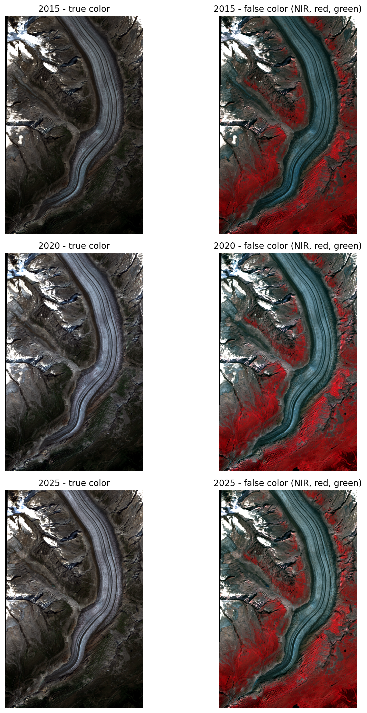

## Project goal

The main goal of this project is to estimate how the selected lower part of the Great Aletsch Glacier changed over time.

Sentinel-2 multispectral images were used to segment the glacier surface and calculate its area for three different years. A DEM-derived elevation-change raster was then used to approximate elevation and volume change for the 2015–2020 period.

The selected glacier tongue was chosen because it is clearly visible in satellite imagery and can be separated relatively well from the surrounding mountain terrain.

## Study area

The study area is the lower tongue of the **Great Aletsch Glacier** in Switzerland.

This part of the glacier has a clear curved shape and visible boundaries, which makes it suitable for image segmentation and surface area comparison.

The figure below shows the selected glacier tongue in true-color satellite images for the analyzed years.

<table>
  <tr>
    <td align="center">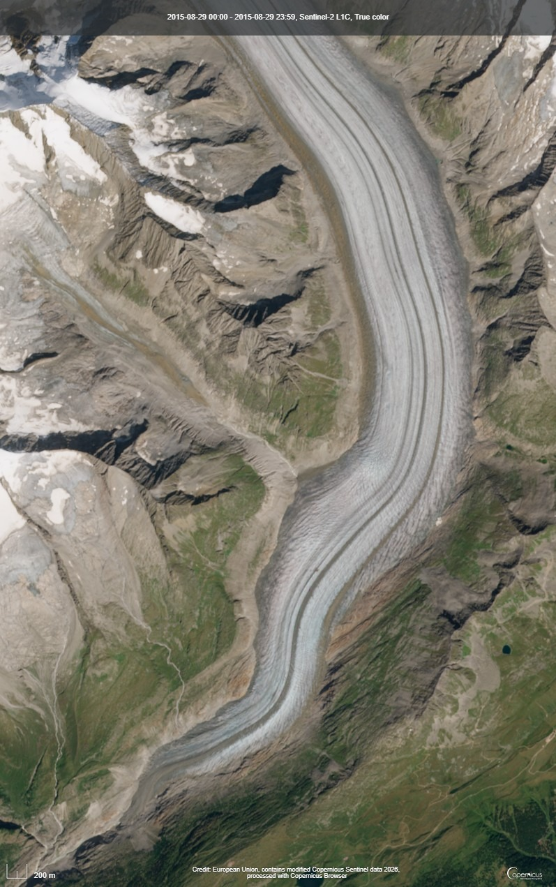<br>2015</td>
    <td align="center">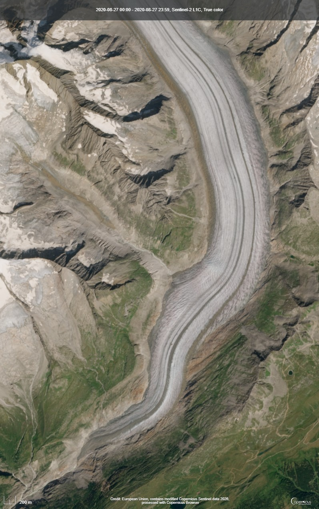<br>2020</td>
    <td align="center">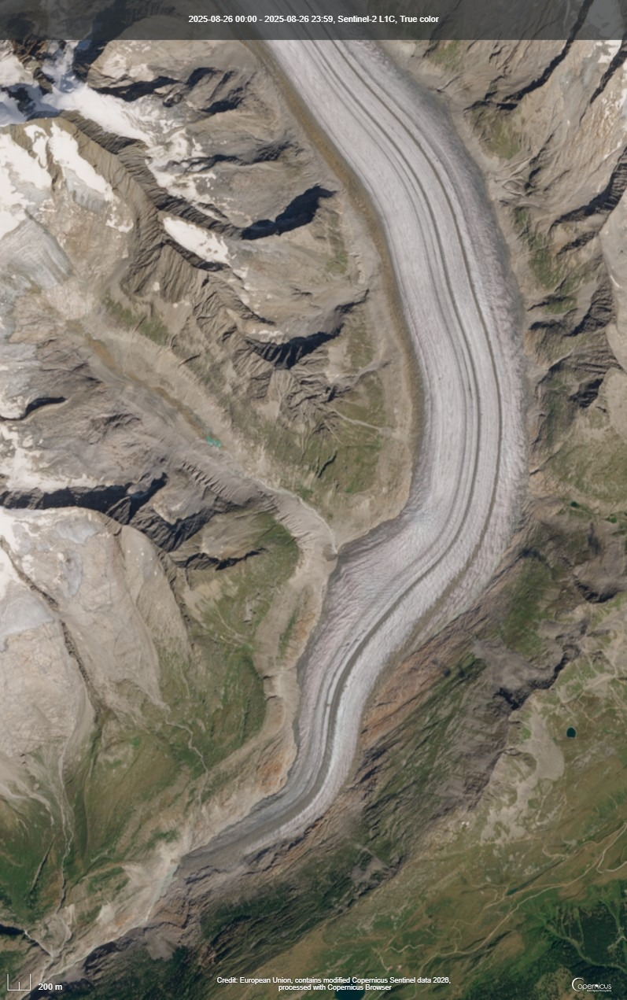<br>2025</td>
  </tr>
</table>

## Data

The project uses Sentinel-2 images downloaded from Copernicus Browser.

Analyzed dates:

- 29 August 2015
- 27 August 2020
- 26 August 2025

Used Sentinel-2 bands:

- B02 – blue
- B03 – green
- B04 – red
- B08 – near infrared
- B11 – short-wave infrared
- B12 – short-wave infrared

The band distributions were checked before thresholding, because snow, ice, rock and shadows can have overlapping brightness values.

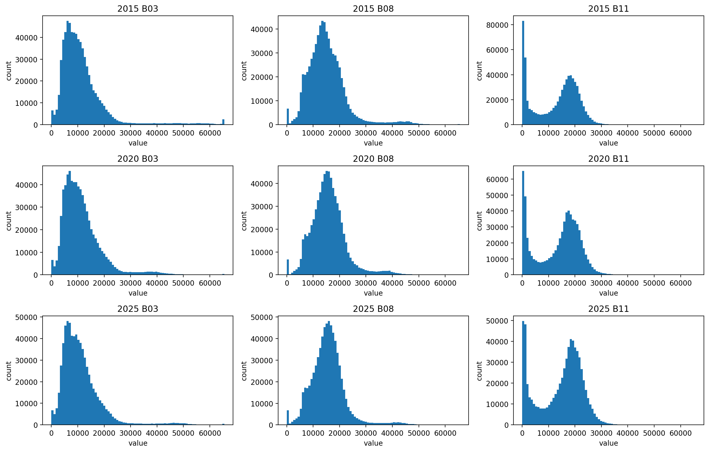

The DEM-derived part uses the file:

```text
N46E008_2015-01-01_2020-01-01_dhdt.tif
```

This raster contains average annual elevation change rate for the period 2015–2020.

## Methods

The glacier surface was detected using spectral indices calculated from Sentinel-2 bands.

The main index was NDSI:

```text
NDSI = (B03 - B11) / (B03 + B11)
```

NDVI was also calculated to reduce confusion with vegetation:

```text
NDVI = (B08 - B04) / (B08 + B04)
```

The NDSI and NDVI maps were used together to separate glacier ice from the surrounding terrain.

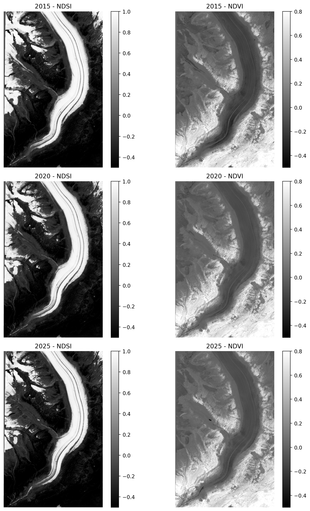

Two segmentation approaches were used:

1. threshold-based segmentation using NDSI and NDVI,
2. K-means clustering as an additional comparison method.

The final glacier surface area values were calculated from the threshold-based mask. Small isolated regions and holes were removed using morphological operations.

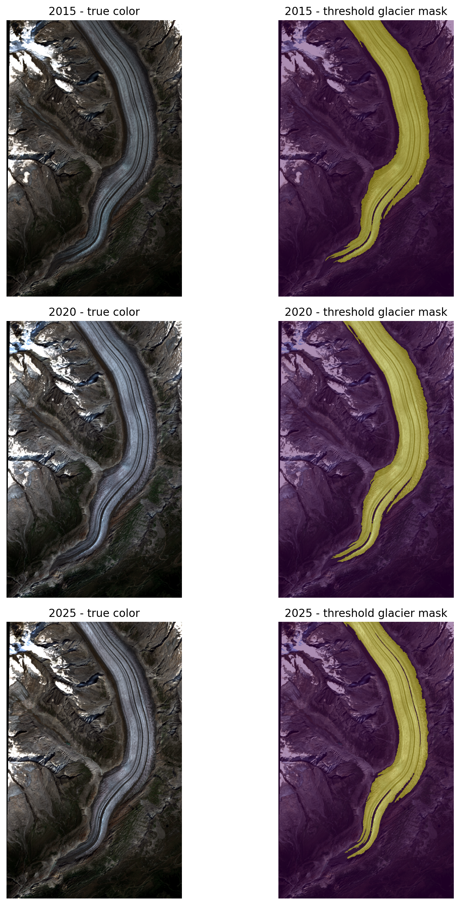

K-means clustering was not used as the final result, but it was useful as a visual comparison with the threshold method.

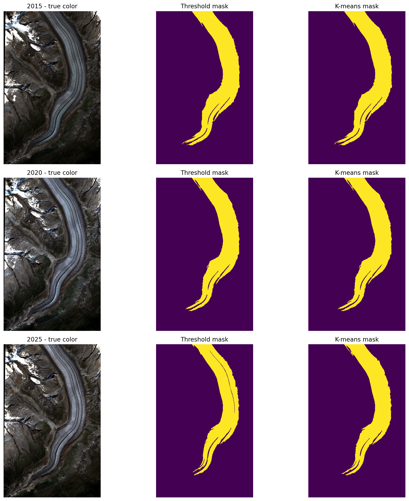

For the volume part, the DEM-derived `dhdt` raster was converted to total elevation change for the 2015–2020 period:

```text
dH = dhdt * 5
```

Approximate volume change was calculated by multiplying elevation change by pixel area and summing over the selected glacier mask.

## Main results

Estimated glacier surface area:

| Year | Glacier area [km²] |
|---|---:|
| 2015 | 11.40 |
| 2020 | 10.81 |
| 2025 | 9.70 |

Between 2015 and 2025, the selected glacier tongue area decreased by **1.70 km²**, which corresponds to approximately **14.91%** of the 2015 area.

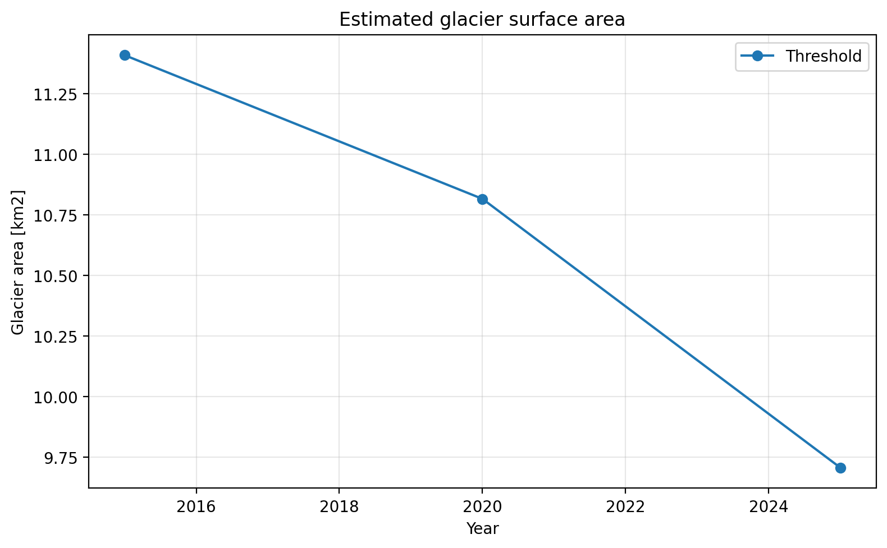

The main threshold-based result was calculated using NDSI > 0.25 together with the
NDVI condition. The sensitivity test was added to check how much the calculated
area changes when the NDSI threshold is modified.

The threshold sensitivity plot shows that the estimated glacier area decreases when
the NDSI threshold is increased. This is expected, because stricter threshold values
classify fewer pixels as glacier. However, the order of the years stays the same for all
tested thresholds: 2015 has the largest glacier area, 2020 is smaller and 2025 is the
smallest. This means that the decreasing trend is stable and is not only caused by
one selected threshold value.

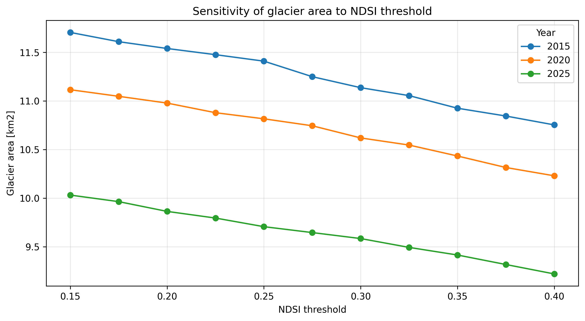

The change map below highlights the part of the glacier that was detected in 2015 but was no longer classified as glacier surface in 2025.

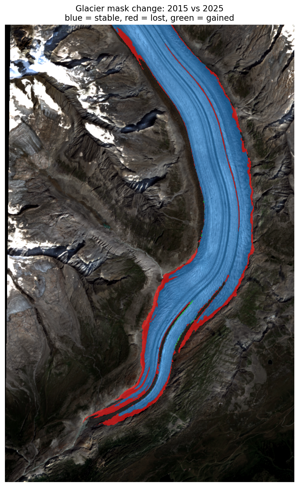

The DEM-derived elevation-change raster shows mainly negative elevation changes over the selected glacier tongue.

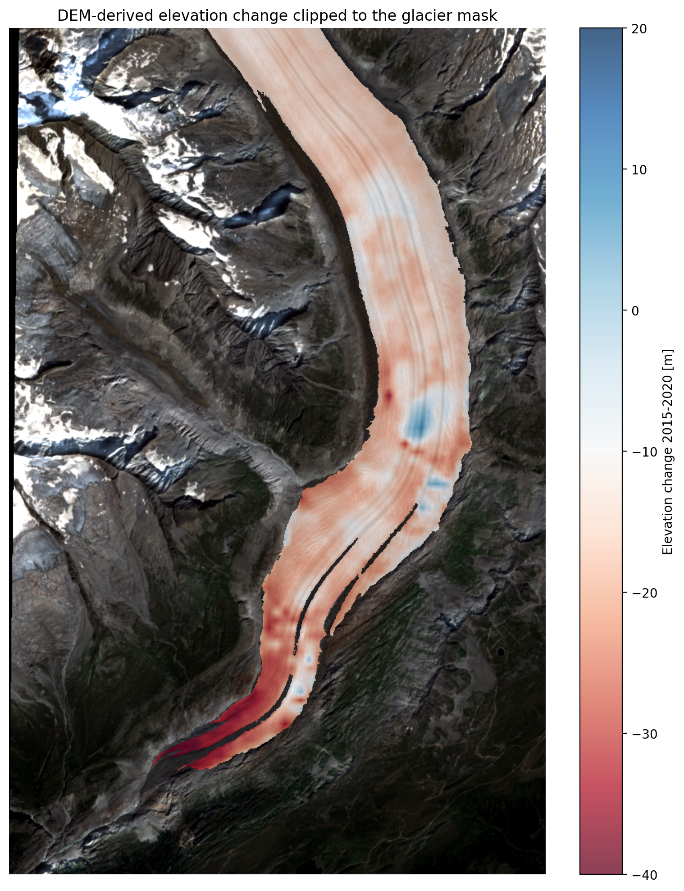

DEM-derived results for 2015–2020:

| Quantity | Value |
|---|---:|
| Mean elevation change [m] | -17.76 |
| Volume change [m³] | -202633792.0 |
| Volume change [km³] | -0.202634 |

## Outputs

The notebook generates:

- true color Sentinel-2 visualizations,
- false color Sentinel-2 visualizations,
- NDSI and NDVI maps,
- threshold-based glacier masks,
- K-means segmentation comparison,
- glacier surface area plots,
- glacier change map between 2015 and 2025,
- DEM-derived elevation-change map,
- approximate volume-change calculation,
- additional threshold sensitivity and DEM statistics.

## Repository structure

```text
.
├── data/
│   ├── 2015_bands/
│   ├── 2020_bands/
│   ├── 2025_bands/
│   └── DEM/
│       └── N46E008_2015-01-01_2020-01-01_dhdt.tif
├── images/
├── files/
├── main.ipynb
├── report.pdf
└── README.md
```

Large raw data files are not included in the repository. They should be downloaded separately from Copernicus Browser and the elevation-change data source.

## Main limitations

The results should be treated as approximate. The most important limitations are:

- seasonal snow patches,
- debris-covered glacier ice,
- shadows,
- different spatial resolution between Sentinel-2 and DEM-derived data,
- uncertainty of threshold-based segmentation,
- lower resolution of the DEM-derived raster.

## Tools and libraries

Main Python libraries used:

- NumPy
- Pandas
- Matplotlib
- Rasterio
- scikit-image
- scikit-learn

## Author

Patryk Kuna
